# Quad Sparkle Admin Web App

A custom-made Admin Portal for a car wash business to track sales and transactions.

This application is built with Flutter, with a plan to share the same code base for a mobile app. It runs on a self-hosted Ubuntu Server and is exposed to the internet through a secured connection via Cloudflare Tunnel. All data has two layers of backup: real-time synchronization and daily snapshots.

P.s. URL below is not the actual URL. Contact me for more details 😄

## Interface

### Front End

User Authentication
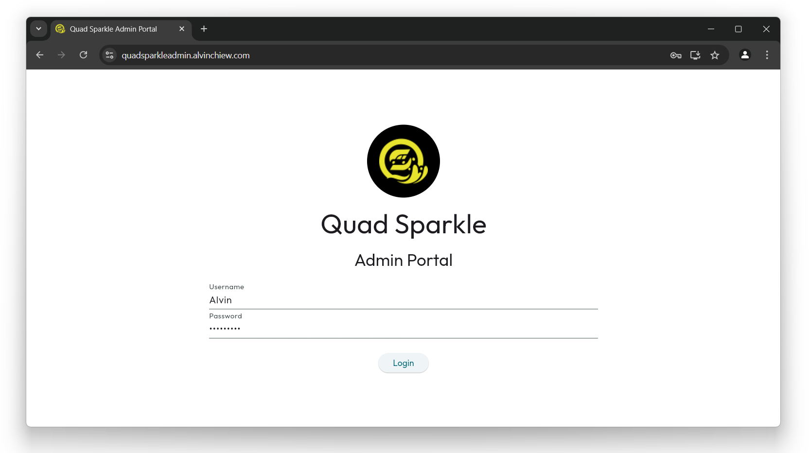

Home Screen / Transactions
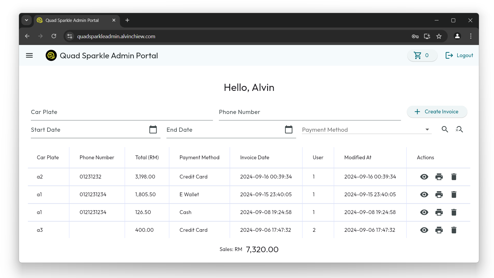

Application Menu
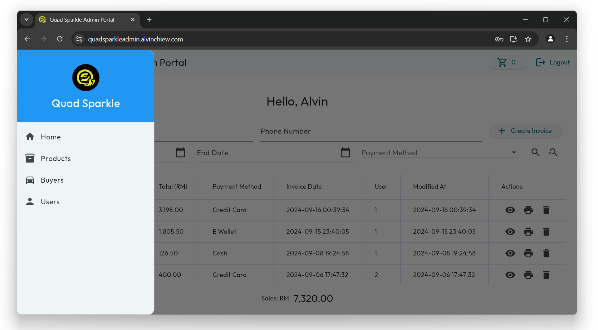

Print Invoice
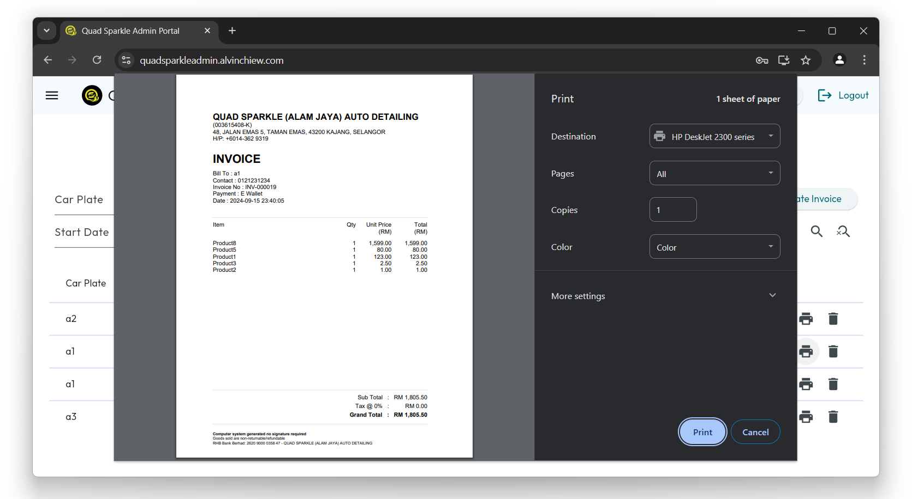

Add To Cart
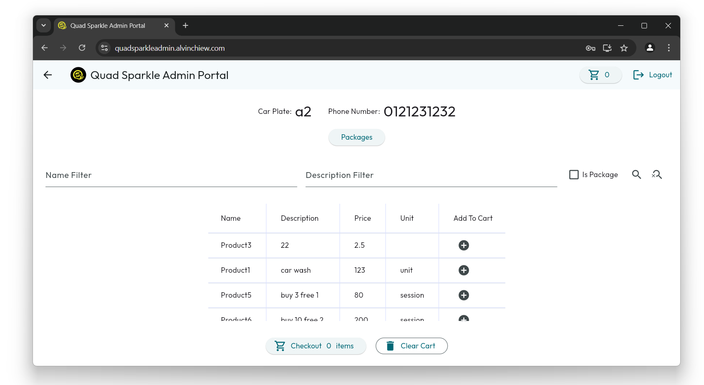

Package Utilization
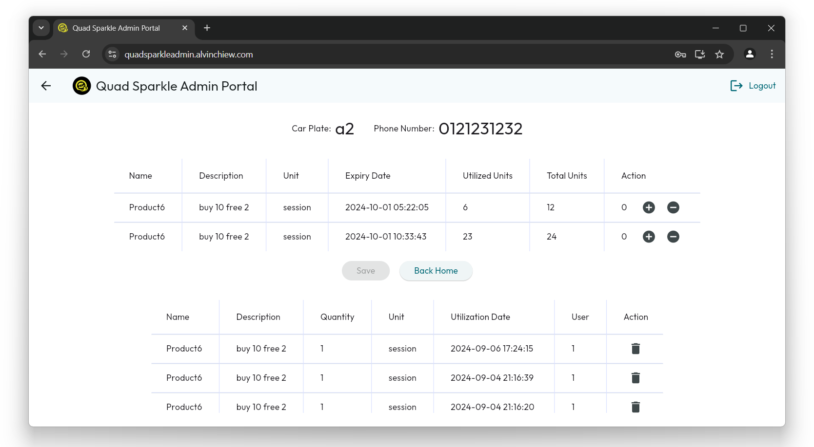

Cart Checkout
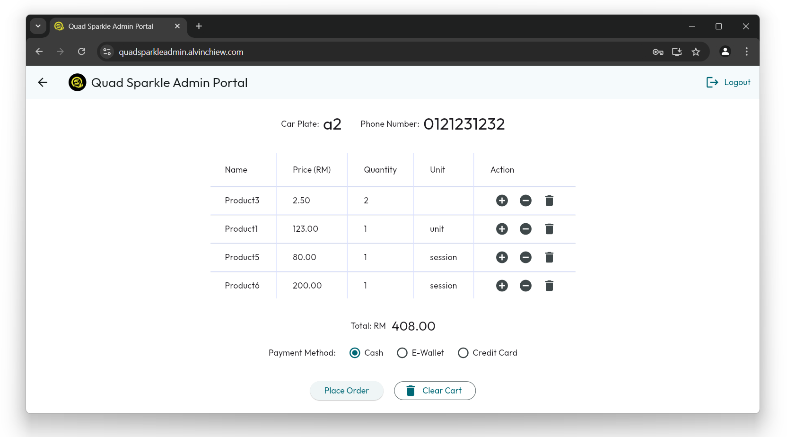

### Middle End

Secured API Services
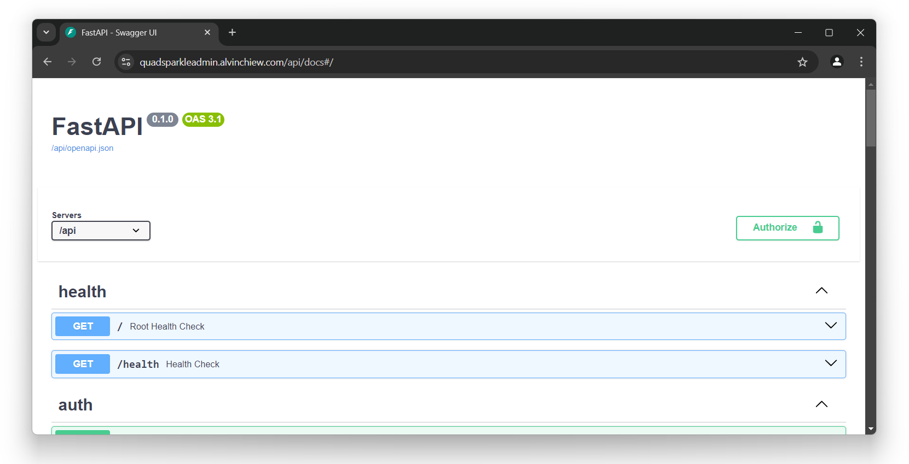

### Back End

SQLite Database
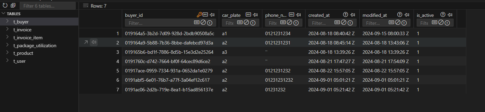

### Infrastructure

Docker Compose & Containers
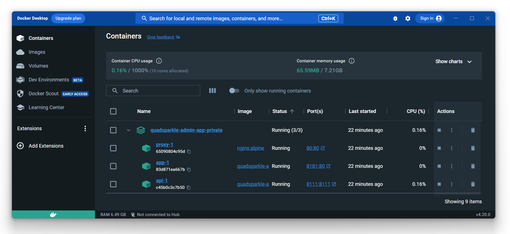

Cloudflare Tunnel
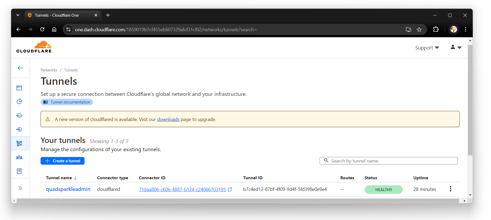

## LICENSE

Copyright (C) Alvin Chiew - All Rights Reserved

Unauthorized usage of this software and associated documentation files (the "Software") including the rights to use, copy, modify, merge, publish, distribute, sublicense, and/or sell copies of the Software, via any medium, is strictly prohibited. The above copyright notice and this permission notice shall be included in all copies or substantial portions of the Software.

Proprietary and confidential.

THE SOFTWARE IS PROVIDED "AS IS", WITHOUT WARRANTY OF ANY KIND, EXPRESS OR
IMPLIED, INCLUDING BUT NOT LIMITED TO THE WARRANTIES OF MERCHANTABILITY,
FITNESS FOR A PARTICULAR PURPOSE AND NONINFRINGEMENT. IN NO EVENT SHALL THE
AUTHORS OR COPYRIGHT HOLDERS BE LIABLE FOR ANY CLAIM, DAMAGES OR OTHER
LIABILITY, WHETHER IN AN ACTION OF CONTRACT, TORT OR OTHERWISE, ARISING FROM,
OUT OF OR IN CONNECTION WITH THE SOFTWARE OR THE USE OR OTHER DEALINGS IN
THE SOFTWARE.
